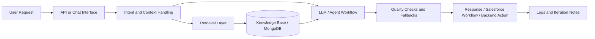

---

## About Me

I am a Computer Science Engineer from Bengaluru, India, building at the overlap of **AI engineering**, **Salesforce automation**, and **backend systems**. I like turning promising AI demos into workflows that people can actually use: grounded retrieval, clean APIs, logs, fallbacks, and the operational details that keep software trustworthy after launch.

`Bengaluru, India` · `Software Engineer, AI + Salesforce @ Visionet Systems` · `Open to AI, Salesforce, Backend roles`

> Build the demo. Ship the system.

---

## Current Focus

- Production-style RAG workflows with retrieval, memory, evaluation, and fallback handling
- Agentforce, Prompt Builder, Flow Builder, Apex, LWC, and Salesforce service automation
- FastAPI services, Dockerized backends, database-backed workflows, and API integrations

---

## What I Build

### AI Engineering

- RAG chat workflows with retrieval, memory, and evaluation-minded iteration
- LLM-powered service recommendation and decision-support workflows
- Prompt design, model behavior checks, grounding checks, and practical AI quality loops
- Local and API-backed LLM workflows using Ollama, OpenAI, LangChain, RAGAS, and LangSmith

### Salesforce Development

- Apex, LWC, Flow Builder, SOQL/SOSL, Service Cloud, Email-to-Case, and Omni-Channel work
- Agentforce and Prompt Builder learning with hands-on Trailhead proof
- Salesforce workflows connected to backend services, automation layers, and AI-assisted processes
- Case management, service automation, and business workflow customization

### Backend Systems

- REST API integrations and backend automation services
- Data-backed workflows using MongoDB, MySQL, and Python services
- Practical debugging, release validation, and production issue resolution
- Dockerized services, Linux-based development, environment configuration, and deployment-minded delivery

---

## Featured Work

### AI Wellness Support Chatbot

Built a local RAG chatbot with Ollama/LLaMA orchestration, MongoDB-backed conversation memory, retrieval flow, and support-focused response logic.

`LLaMA` `Ollama` `RAG` `MongoDB` `Python`

### AI Service Recommendation System

Converted user intent into service suggestions using prompt design, API-backed workflow logic, structured decision paths, and backend integration.

`OpenAI API` `Python` `REST APIs` `Workflow Logic`

### Fake News Detection System

Created an end-to-end NLP classification pipeline with preprocessing, sequence modeling, training flow, and prediction logic.

`NLP` `LSTM` `Python` `Text Classification`

> Some enterprise/internal build notes are private, but architecture summaries are available on request.

---

## Architecture Snapshot

The systems I enjoy building usually look like this:

Not just the model call: the surrounding system that makes the result useful, traceable, and easier to improve.

---

## Credentials & Proof

- Agentblazer Champion 2025
- 102 Trailhead badges, 58,450 points, 13 trails, and 4 Superbadges
- Agentforce Service
- Prompt Builder Templates
- Case Lifecycle Superbadge Unit
- Financial Services Cloud Specialist
- Published NLP/chatbot research with DOI

[Salesforce Trailblazer](https://www.salesforce.com/trailblazer/gouthamgovardhan)

---

## Published Work

**Intent Classification Chatbot: Creating a Real-Time Conversational Agent with Deep Learning and Natural Language Processing**

- Journal: International Research Journal of Modernization in Engineering Technology and Science (IRJMETS)
- Published: 20 Jan 2024
- DOI: [`10.56726/IRJMETS48292`](https://doi.org/10.56726/IRJMETS48292)
- Focus: deep learning, NLP, chatbot design, intent classification, and agricultural support workflows

---

## Deployment & Operations

- Build backend services with practical API boundaries, validation, and environment-aware configuration
- Work with Docker, Linux, Git/GitHub, database connections, and release validation habits
- Care about logs, error handling, fallbacks, and supportability after a workflow ships
- Prefer small, testable service pieces that can connect cleanly to Salesforce, AI workflows, and external APIs

---

## Tech Stack

---

## GitHub Analytics

---

## Connect

[GitHub](https://github.com/gouthamgovardhan) ·
[LinkedIn](https://linkedin.com/in/goutham-govardhan) ·
[Portfolio](https://gouthamgovardhan.github.io/portfolio/) ·
[Trailblazer](https://www.salesforce.com/trailblazer/gouthamgovardhan) ·
[Email](mailto:gouthamgovardhan@hotmail.com)

