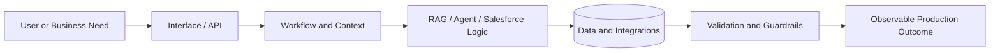

`Bengaluru, India` · `Salesforce Consultant` · `AI Systems Builder`

## About

I build complete AI products—not only model calls. My work spans **LLM and RAG workflows, backend APIs, databases, integrations, observability, and deployment**.

In my current professional role, I deliver Salesforce solutions using **Apex, LWC, Flow, integrations, Agentforce, and Prompt Builder**. My broader collaborative engineering work covers AI and platform systems from architecture through production readiness. Organization, client, and internal product details are intentionally omitted.

> **Build the intelligence. Engineer the system. Ship it reliably.**

## What I Work Across

| Area | Focus |
| --- | --- |
| **AI systems** | LLM applications, RAG, agentic workflows, prompting, retrieval evaluation |
| **Backend & platform** | Python, FastAPI, REST APIs, authentication, databases, caching |
| **Salesforce** | Apex, LWC, Flow, SOQL, integrations, Agentforce, Prompt Builder |
| **Production delivery** | Docker, logging, observability, testing, debugging, documentation |

## System View

## Selected Engineering Work

### End-to-End AI Platform

Contribute within a collaborative engineering team across AI workflows, backend services, REST APIs, authentication, databases, caching, integrations, logging, monitoring, and deployment workflows.

### Salesforce Consulting & Automation

Build maintainable platform solutions with Apex, LWC, Flow, API integrations, Agentforce, Prompt Builder, testing, debugging, and release support.

### RAG Support Assistant

Built a conversational workflow using LLaMA through Ollama, retrieval-augmented generation, document chunking, persistent context, and support-focused safety checks.

## Core Stack

## Credentials & Research

- **Agentblazer Champion 2025**
- **102 Trailhead badges**, 13 trails, and 4 Superbadges
- Agentforce Service and Prompt Builder Templates Superbadges
- Salesforce Certified AI Associate
- Published research on an intent-classification conversational agent using deep learning and NLP

**Publication:** [Intent Classification Chatbot: Creating a Real-Time Conversational Agent with Deep Learning and Natural Language Processing](https://doi.org/10.56726/IRJMETS48292) · IRJMETS · January 2024

## GitHub Snapshot

### Let’s connect

[Portfolio](https://gouthamgovardhan.github.io/portfolio/) · [LinkedIn](https://linkedin.com/in/goutham-govardhan) · [Trailblazer](https://www.salesforce.com/trailblazer/gouthamgovardhan) · [Email](mailto:gouthamgovardhan@hotmail.com)

