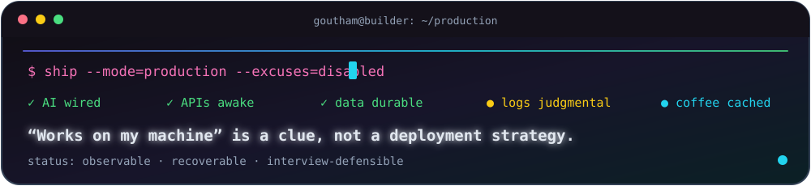
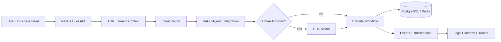

`Bengaluru, India` · `Salesforce Consultant` · `AI Systems Builder`

## About

I build complete AI products—not only model calls. My work spans **LLM and RAG workflows, backend APIs, multi-tenant product systems, databases, integrations, observability, security, and deployment**.

In my current professional role, I deliver Salesforce solutions using **Apex, LWC, Flow, integrations, Agentforce, and Prompt Builder**. In broader collaborative engineering work, I contribute across AI, backend, frontend, cloud-cost, and platform reliability concerns. Organization, client, tenant, credential, and internal product details are intentionally omitted.

  

## What I Actually Build

| Area | Systems and problems I work across |
| --- | --- |
| **AI & agents** | LLM applications, RAG, intent routing, agent orchestration, evaluation, HITL approval flows |
| **Backend & SaaS** | Python, FastAPI, REST APIs, auth, RBAC, tenancy, feature flags, notifications, error handling |
| **Product UI** | Next.js, React, TypeScript dashboards, onboarding, admin tools, resilient loading and error states |
| **Cloud & FinOps** | AWS, Azure, GCP, billing ingestion, cost visibility, connector workflows, async synchronization |
| **Data & runtime** | PostgreSQL, pgvector, Redis, background workers, migrations, caching, durable chat state |
| **Production delivery** | Docker, CI/CD, structured logs, Grafana/Loki, testing, security hardening, incident debugging |
| **Salesforce** | Apex, LWC, Flow, SOQL, service automation, API integrations, Agentforce, Prompt Builder |

<strong>Private collaborative platform work — the useful details I can share</strong>

### AI orchestration

- Contributed to conversational AI flows that classify intent and route work to specialized agents and tools
- Worked on RAG ingestion, retrieval, vector storage, grounding, follow-up context, and human approval paths
- Hardened provider failures so authentication, model, and tool errors become useful product states instead of mysterious 500s

### Full-stack product engineering

- Built and repaired multi-tenant authentication, authorization, role-aware navigation, feature flags, invitations, and session flows
- Worked across notification and error engines, realtime updates, action centers, onboarding tours, settings, and admin surfaces
- Connected Next.js product experiences to typed FastAPI services with practical loading, validation, and failure handling

### Cloud, integrations, and FinOps

- Contributed to cloud inventory, billing synchronization, cost dashboards, anomaly context, and connector lifecycle workflows
- Worked with AWS, Azure, GCP, Databricks, SaaS integrations, background workers, encrypted credentials, and delegated access
- Improved asynchronous synchronization, API reliability, permission boundaries, and operational visibility

### Reliability and delivery

- Worked with PostgreSQL/pgvector, Redis, Alembic migrations, Docker Compose, workers, caching, and durable checkpoints
- Added structured logging, metrics, Grafana/Loki paths, health checks, CI validation, security controls, and production diagnostics
- Debugged the glamorous parts of software engineering: cookies, CORS, migrations, stale containers, race conditions, and “but it worked locally”

## Architecture I Like Shipping

> The model is one box. Production is all the other boxes arguing with it.

## Selected Work

### Collaborative AI Operations Platform

Contribute across agentic workflows, RAG, full-stack SaaS features, integrations, cloud-cost tooling, auth/RBAC, notifications, observability, workers, data systems, and production debugging. Built with a team; organization and internal product details are omitted.

### Salesforce Consulting & Automation

Build maintainable platform solutions with Apex, LWC, Flow, API integrations, Agentforce, Prompt Builder, testing, debugging, and release support.

### RAG Support Assistant

Built a conversational workflow using LLaMA through Ollama, retrieval-augmented generation, document chunking, persistent context, and support-focused safety checks.

### Developer Portfolio

Designed and shipped a responsive React/TypeScript portfolio with privacy-safe case studies, accessible expandable detail, selective motion, theme persistence, and GitHub Pages deployment.

## Toolbox

 

## Credentials & Research

- **Agentblazer Champion 2025**
- **102 Trailhead badges**, 13 trails, and 4 Superbadges
- Agentforce Service and Prompt Builder Templates Superbadges
- Salesforce Certified AI Associate
- Published research on an intent-classification conversational agent using deep learning and NLP

**Publication:** [Intent Classification Chatbot: Creating a Real-Time Conversational Agent with Deep Learning and Natural Language Processing](https://doi.org/10.56726/IRJMETS48292) · IRJMETS · January 2024

## GitHub Snapshot

## Contribution Arcade

No streak pressure. Just a snake eating whatever actually shipped.

<picture>
  <source media="(prefers-color-scheme: dark)" srcset="https://raw.githubusercontent.com/gouthamgovardhan/gouthamgovardhan/output/github-contribution-grid-snake-dark.svg" />
  <source media="(prefers-color-scheme: light)" srcset="https://raw.githubusercontent.com/gouthamgovardhan/gouthamgovardhan/output/github-contribution-grid-snake.svg" />
  
</picture>

### Let’s connect

[Portfolio](https://gouthamgovardhan.github.io/portfolio/) · [LinkedIn](https://linkedin.com/in/goutham-govardhan) · [Trailblazer](https://www.salesforce.com/trailblazer/gouthamgovardhan) · [Email](mailto:gouthamgovardhan@hotmail.com)

